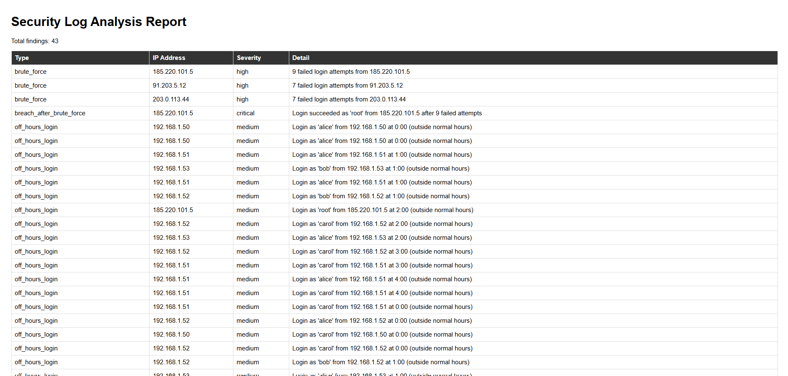

# Security Log Analyzer

A Python tool that parses Linux SSH authentication logs and detects 
suspicious activity — brute-force attempts, successful logins following 
repeated failures, off-hours access, username enumeration, and sudo 
command spikes — then generates a visual HTML report summarizing 
the findings.

## Why I built this
I wanted hands-on practice with the kind of log analysis security 
analysts do daily: turning raw, noisy log data into a clear, 
actionable report. This project covers parsing real-world log 
formats with regex, building rule-based detection logic across 
multiple attack patterns, and presenting findings in a usable format.

## Features
- Parses standard Linux `auth.log` format using regex
- Detects brute-force SSH attempts (configurable failure threshold)
- Flags successful logins that follow repeated failed attempts (likely breach)
- Detects off-hours logins (e.g. midnight–5am)
- Flags username enumeration (one IP trying many different usernames)
- Flags unusual spikes in sudo command usage per user
- Generates a styled HTML report with a findings table
- Configurable via command-line flags
- Includes a script to generate realistic synthetic log data
- Covered by unit tests (pytest)

## How to run it
```bash
pip install -r requirements.txt
python generate_sample_log.py          # optional: regenerate sample data
python main.py --log sample_logs/auth.log --output report.html
```

Optional flags:
- `--threshold N` — number of failures before flagging as brute force (default: 5)

## Running tests
```bash
pytest
```

## Sample output


## Tech stack
Python, regex, pytest, argparse
